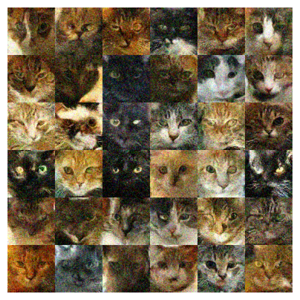

# CAT-Diffusion
Minimalist design for DDCM. To produce new cat images using the pretrained model, please run demo.ipynb. To train your own model, please place the images under Data/Cats and run train.ipynb. The dataset is taken from Kaggle over [here](https://www.kaggle.com/datasets/spandan2/cats-faces-64x64-for-generative-models).
 
# References
https://github.com/TeaPearce/Conditional_Diffusion_MNIST and special thanks to Jonathan Kao's ECENGR 239AS course

